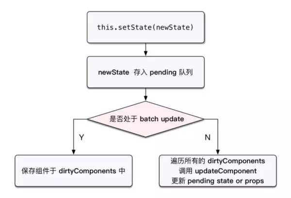
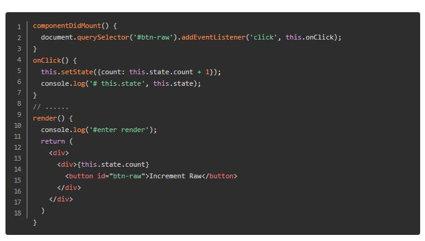
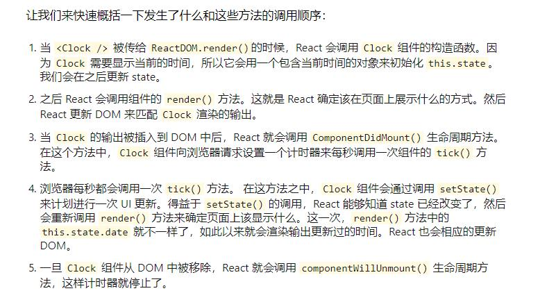
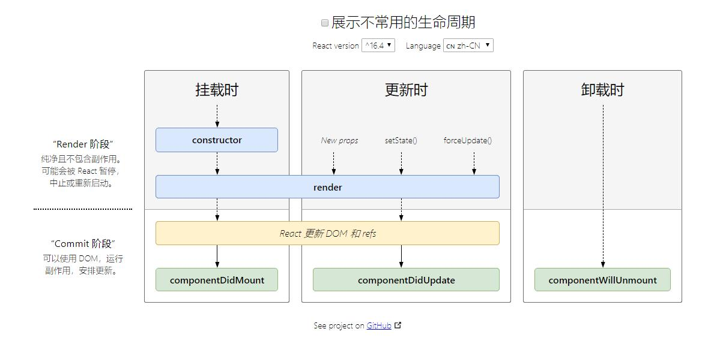
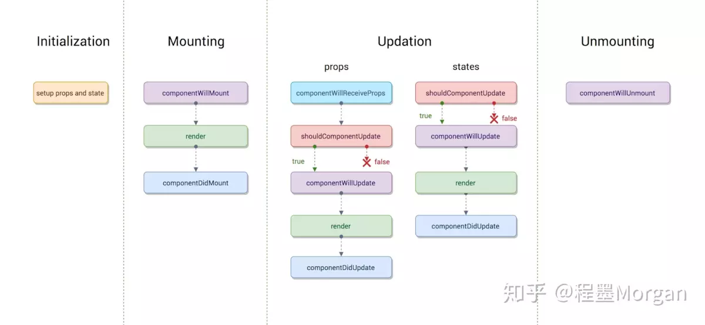

# 1.将函数组件转换成 class 组件

通过以下五步将 Clock 的函数组件转成 class 组件：

1. 创建一个同名的 ES6 class，并且继承于 React.Component。

2. 添加一个空的 render() 方法。

3. 将函数体移动到 render() 方法之中。

4. 在 render() 方法中使用 this.props 替换 props。

5. 删除剩余的空函数声明。

# 2.状态
* 不要直接修改 State,而是应该使用 setState()
* State 的更新可能是异步的
* State 的更新会被合并

```
setState 方法与包含在其中的执行是一个很复杂的过程，从 React 最初的版本到现在，也有无数次的修改。它的工作除了要更动 this.state 之外，还要负责触发重新渲染，这里面要经过 React 核心 diff 算法，最终才能决定是否要进行重渲染，以及如何渲染。而且为了批次与效能的理由，多个 setState 呼叫有可能在执行过程中还需要被合并，所以它被设计以延时的来进行执行是相当合理的。

在 React 的 setState 函数实现中，会根据一个变量 isBatchingUpdates 判断是直接更新 this.state 还是放到队列中回头再说，而 isBatchingUpdates 默认是 false，也就表示 setState 会同步更新 this.state，但是，有一个函数 batchedUpdates，这个函数会把 isBatchingUpdates 修改为 true，而当 React 在调用事件处理函数之前就会调用这个 batchedUpdates，造成的后果，就是由 React 控制的事件处理过程 setState 不会同步更新 this.state。
```

那么我们可以总结一下：

* 由 React 控制的事件处理过程 setState 不会同步更新 this.state！

* React 控制之外的情况， setState 会同步更新 this.state！


但大部份的使用情况下，我们都是使用了 React 库中的表单组件，例如 select、input、button 等等，它们都是 React 库中人造的组件与事件，是处于 React 库的控制之下，比如组件原色 onClick 都是经过 React 包装。在这个情况下，setState 就会以异步的方式执行。

所以一般来说，很多人会误认为 setState 就是异步执行，实际上，绕过 React 通过 JavaScript 原生 addEventListener 直接添加的事件处理函数，还有使用 setTimeout/setInterval 等 React 无法掌控的 APIs情况下，就会出现同步更新 state 的情况。


```
import React, { Component } from 'react';

class App extends Component{
  constructor(props){
    super(props)
    this.state = {
      val:0
    }
  }

  componentDidMount(){
    this.setState({val:this.state.val+1})
    console.log(this.state.val)//0

    this.setState({val:this.state.val+1})
    console.log(this.state.val)//0

    this.timer = setTimeout(() => {
      console.log(this.state.val)//1
      this.setState({val:this.state.val+1})
      console.log(this.state.val)//2

      this.setState({val:this.state.val+1})
      console.log(this.state.val)//3
    },0)
  }

  componentWillUnmount(){
    clearTimeout(this.timer)
  }

  render(){
    return <div>{this.state.val}</div>
  }
}


export default App
```

# 3.生命周期




#### 第一个是组件初始化(initialization)阶段
也就是以下代码中类的构造方法( constructor() ),Test类继承了react Component这个基类，也就继承这个react的基类，才能有render(),生命周期等方法可以使用，这也说明为什么函数组件不能使用这些方法的原因。

super(props)用来调用基类的构造方法( constructor() ), 也将父组件的props注入给子组件，功子组件读取(组件中props只读不可变，state可变)。
而constructor()用来做一些组件的初始化工作，如定义this.state的初始内容。

#### 第二个是组件的挂载(Mounting)阶段
##### 此阶段分为componentWillMount，render，componentDidMount三个时期。
* componentWillMount:

在组件挂载到DOM前调用，且只会被调用一次，在这边调用this.setState不会引起组件重新渲染，也可以把写在这边的内容提前到constructor()中，所以项目中很少用。

* render:

根据组件的props和state（无两者的重传递和重赋值，论值是否有变化，都可以引起组件重新render） ，return 一个React元素（描述组件，即UI），不负责组件实际渲染工作，之后由React自身根据此元素去渲染出页面DOM。render是纯函数（Pure function：函数的返回结果只依赖于它的参数；函数执行过程里面没有副作用），不能在里面执行this.setState，会有改变组件状态的副作用。

* componentDidMount:

组件挂载到DOM后调用，且只会被调用一次

#### 第三个是组件的更新(update)阶段
在讲述此阶段前需要先明确下react组件更新机制。setState引起的state更新或父组件重新render引起的props更新，更新后的state和props相对之前无论是否有变化，都将引起子组件的重新render。

造成组件更新有两类（三种）情况：
* 1.父组件重新render
父组件重新render引起子组件重新render的情况有两种

a. 直接使用,每当父组件重新render导致的重传props，子组件将直接跟着重新渲染，无论props是否有变化。可通过shouldComponentUpdate方法优化。

b.在componentWillReceiveProps方法中，将props转换成自己的state


根据官网的描述
```
在该函数(componentWillReceiveProps)中调用 this.setState() 将不会引起第二次渲染。
```

是因为componentWillReceiveProps中判断props是否变化了，若变化了，this.setState将引起state变化，从而引起render，此时就没必要再做第二次因重传props引起的render了，不然重复做一样的渲染了。

* 2.组件本身调用setState，无论state有没有变化。可通过shouldComponentUpdate方法优化。

此阶段分为componentWillReceiveProps，shouldComponentUpdate，componentWillUpdate，render，componentDidUpdate
* componentWillReceiveProps(nextProps)

此方法只调用于props引起的组件更新过程中，参数nextProps是父组件传给当前组件的新props。但父组件render方法的调用不能保证重传给当前组件的props是有变化的，所以在此方法中根据nextProps和this.props来查明重传的props是否改变，以及如果改变了要执行啥，比如根据新的props调用this.setState出发当前组件的重新render

* shouldComponentUpdate(nextProps, nextState)

此方法通过比较nextProps，nextState及当前组件的this.props，this.state，返回true时当前组件将继续执行更新过程，返回false则当前组件更新停止，以此可用来减少组件的不必要渲染，优化组件性能。

ps：这边也可以看出，就算componentWillReceiveProps()中执行了this.setState，更新了state，但在render前（如shouldComponentUpdate，componentWillUpdate），this.state依然指向更新前的state，不然nextState及当前组件的this.state的对比就一直是true了。

* componentWillUpdate(nextProps, nextState)

此方法在调用render方法前执行，在这边可执行一些组件更新发生前的工作，一般较少用。

* render

render方法在上文讲过，这边只是重新调用。

* componentDidUpdate(prevProps, prevState)

此方法在组件更新后被调用，可以操作组件更新的DOM，prevProps和prevState这两个参数指的是组件更新前的props和state

#### 卸载阶段
此阶段只有一个生命周期方法：componentWillUnmount

* componentWillUnmount

此方法在组件被卸载前调用，可以在这里执行一些清理工作，比如清楚组件中使用的定时器，清楚componentDidMount中手动创建的DOM元素等，以避免引起内存泄漏。